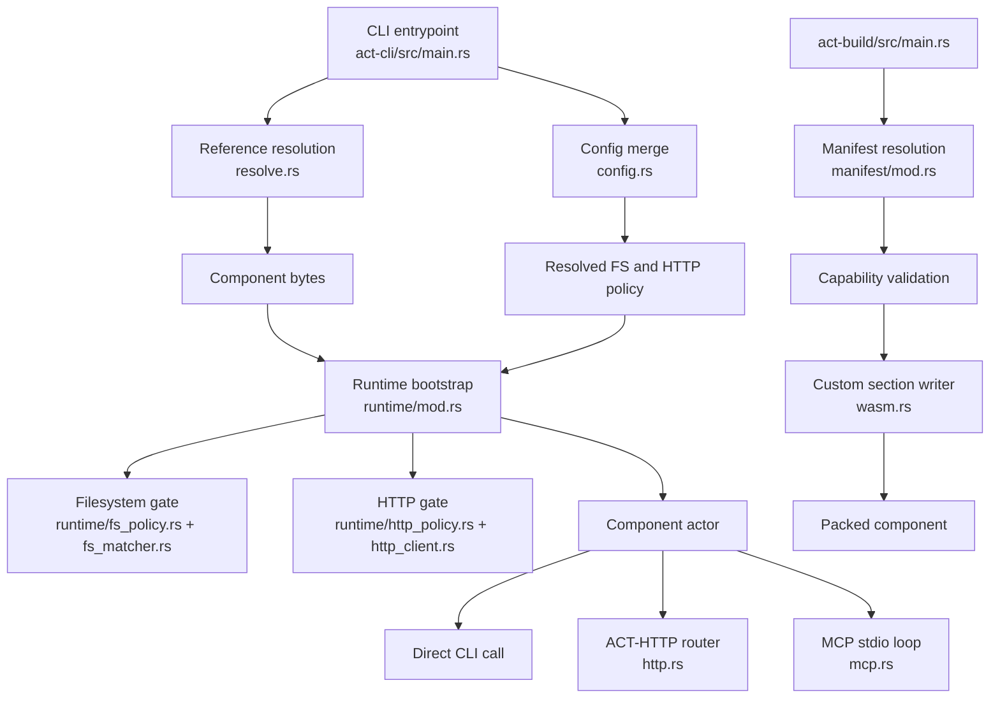

The repository is a two-binary Rust workspace. `act` is the runtime host in `act-cli/src`, and `act-build` is the packaging tool in `act-build/src`. Both share the ACT component model defined by the WIT world in `act-cli/wit/world.wit`.



## Module Responsibilities

- `act-cli/src/main.rs` defines the command surface, parses options, resolves policy and metadata, and wires transports to the runtime.
- `act-cli/src/resolve.rs` turns a local path, HTTP URL, or OCI reference into a local cached `.wasm` file.
- `act-cli/src/config.rs` merges config file state, profile state, and CLI overrides into `FsConfig`, `HttpConfig`, and merged metadata.
- `act-cli/src/runtime/mod.rs` creates the Wasmtime engine, linker, store, and long-lived actor loop that serializes component requests.
- `act-cli/src/runtime/fs_policy.rs` and `act-cli/src/runtime/fs_matcher.rs` enforce the filesystem side of the sandbox.
- `act-cli/src/runtime/http_policy.rs`, `http_client.rs`, and `network.rs` enforce outbound HTTP policy, including redirect and DNS filtering.
- `act-cli/src/http.rs` and `mcp.rs` adapt the same actor API to ACT-HTTP and MCP.
- `act-build/src/manifest/*.rs`, `pack.rs`, `validate.rs`, `skill.rs`, and `wasm.rs` resolve metadata, validate declarations, and write custom sections back into the component.

## Key Design Decisions

### Actor-based component access

`spawn_component_actor` in `act-cli/src/runtime/mod.rs` owns the `Store<HostState>` and serializes requests over a Tokio channel. That decision matters because Wasmtime component stores are stateful and awkward to share across unrelated async entry points. By routing `call`, HTTP handlers, and MCP messages through the same actor, the code keeps one concurrency boundary and one error-mapping layer.

### Policy is resolved before instantiation

`resolve_opts` in `act-cli/src/main.rs` calls `resolve_fs_config`, `resolve_http_config`, and `resolve_metadata` before the component is instantiated. `create_store` in `act-cli/src/runtime/mod.rs` then intersects those grants with the component's declared capabilities through `effective::effective_fs` and `effective::effective_http`. That creates a ceiling model: users cannot grant capabilities the component never declared, and components cannot silently exceed the host policy.

### Filesystem and HTTP are implemented as separate host adapters

The filesystem path is enforced by shadowing `wasi:filesystem` bindings with a custom host implementation in `runtime/fs_policy.rs`. HTTP is enforced with `WasiHttpHooks` plus a reqwest-backed client in `runtime/http_policy.rs` and `runtime/http_client.rs`. That split exists because the two capabilities fail differently: filesystem needs path canonicalization and descriptor tracking, while HTTP needs scheme, method, redirect, and DNS-aware filtering.

### Build-time metadata uses merge-patch instead of a new manifest format

`act-build` intentionally treats `Cargo.toml`, `pyproject.toml`, `package.json`, and `act.toml` as layered sources in `act-build/src/manifest/mod.rs`. The code applies RFC 7396 merge-patch so project metadata can stay close to the existing build toolchain. This avoids inventing a mandatory new manifest while still letting `act.toml` override everything else.

## Request and Data Lifecycle

```mermaid
sequenceDiagram
  participant User
  participant CLI as act main.rs
  participant Resolve as resolve.rs
  participant Runtime as runtime/mod.rs
  participant Policy as fs/http policy
  participant Actor as Component actor
  participant Transport as call/http/mcp

  User->>CLI: act call <component> <tool>
  CLI->>Resolve: resolve(component_ref fresh=false)
  Resolve-->>CLI: local wasm path
  CLI->>Runtime: read_component_info(bytes)
  CLI->>Runtime: create_engine + load_component + create_linker
  CLI->>Policy: create_store(fs, http, capabilities)
  CLI->>Actor: spawn_component_actor(instance, store)
  Transport->>Actor: ComponentRequest::CallTool
  Actor->>Actor: provider.call_call_tool(...)
  Actor-->>Transport: Tool events or error
  Transport-->>User: stdout, JSON, SSE, or MCP response
```

The `run` path differs only at the last stage. Instead of immediately sending one `CallTool` request, `main.rs` builds either an `axum::Router` with `http::create_router` or a stdio loop with `mcp::run_stdio`. Both transports reuse the same `ComponentHandle` and the same `ComponentRequest` variants.

`act-build` has its own lifecycle:

1. `pack::run` walks up from the `.wasm` file to find a project root.
2. `manifest::resolve` builds `ComponentInfo` from language-native manifests and optional `act.toml`.
3. `manifest::validate::validate` checks filesystem globs and HTTP declarations early.
4. `wasm::set_custom_section` writes `act:component`, optional `act:skill`, and metadata sections back into the component.
5. `validate::run` can later verify the section and the exported `act:core/tool-provider` interface.

The rest of the docs break those stages down in detail. Start with [Component References](/docs/component-references) if you care about resolution and caching, [Runtime Policies](/docs/runtime-policies) if you care about sandboxing, or [Build Pipeline](/docs/component-packaging) if you care about authoring components.
