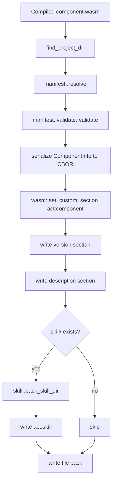

`act-build` is the authoring half of the repository. Where `act` is concerned with runtime behavior, `act-build` is concerned with making a compiled WASM component self-describing. It exists so hosts can rely on embedded metadata instead of out-of-band packaging conventions.

## What the Concept Is

The build pipeline centers on three custom sections:

- `act:component` for serialized `ComponentInfo`.
- `act:skill` for an optional tar archive of a `skill/` directory.
- Standard `version` and `description` sections for convenient fallback metadata.

`pack::run` in `act-build/src/pack.rs` orchestrates the pipeline. `validate::run` in `act-build/src/validate.rs` verifies that a component has the right metadata and exports the expected `act:core/tool-provider` interface.

## How It Relates to Other Concepts

- The resulting `act:component` section is what powers [Runtime Policies](/docs/runtime-policies), because capability declarations live there.
- `act info` and `runtime::read_component_info` depend on the same section to avoid a full instantiation when metadata alone is enough.
- `act skill` depends on `act:skill` being embedded by this build pipeline.

## Internal Logic

The metadata resolution order in `act-build/src/manifest/mod.rs` is:

1. Base metadata from `Cargo.toml`, `pyproject.toml`, or `package.json`.
2. Inline ACT patch from `[package.metadata.act]`, `[tool.act]`, or `act`.
3. Final override from `act.toml`.

That merged `ComponentInfo` is validated, serialized to CBOR, and then inserted into the component with `wasm::set_custom_section`. `pack::run` also calls `skill::pack_skill_dir`, which requires a `skill/SKILL.md` file if the directory exists.



## Basic Usage

Pack a component after compilation:

```bash
act-build pack ./target/wasm32-wasip2/release/my_component.wasm
```

With a Rust project, `manifest::resolve` first tries `cargo metadata` so workspace-inherited package fields still resolve correctly. If `cargo metadata` is unavailable, it falls back to raw TOML parsing in `manifest/cargo.rs`.

Validate a packed component:

```bash
act-build validate ./target/wasm32-wasip2/release/my_component.wasm
```

`validate::run` reads the `act:component` custom section, decodes it as `act_types::ComponentInfo`, checks that `std.name` and `std.version` are present, and scans the component export section for a name containing `act:core/tool-provider`.

## Advanced and Edge-case Usage

Use `act.toml` to override language-native metadata:

```toml
[std]
name = "search-component"
version = "1.2.3"
description = "Search tools for internal docs"

[std.capabilities."wasi:http"]
allow = [{ host = "api.example.com", scheme = "https" }]
```

That file is applied last, so it can refine or replace fields discovered from `Cargo.toml`, `pyproject.toml`, or `package.json`.

Package a skill with the component:

```text
my-project/
  skill/
    SKILL.md
    references/
      usage.md
```

When `pack` runs, `skill::pack_skill_dir` archives the entire `skill/` directory and embeds it as `act:skill`. Later, `act skill ./component.wasm` can extract that archive into `.agents/skills/<component-name>/`.

<Callout type="warn">The inline metadata key names in the current source are `act` for JavaScript, `[tool.act]` for Python, and `[package.metadata.act]` for Rust. If you follow older examples that use `actComponent` or `[package.metadata.act-component]`, the code in `act-build/src/manifest/*.rs` will not pick them up.</Callout>

<Accordions>
<Accordion title="Why use merge-patch instead of a custom merge algorithm?">

The build pipeline serializes `ComponentInfo` to JSON, applies RFC 7396 merge-patch, and then deserializes the result. That choice makes precedence rules easy to explain and keeps overrides expressive without a bespoke domain-specific language.

The trade-off is that patches are structural, not semantic: replacing an object or array is blunt and requires care in `act.toml`.

In practice that is acceptable because the metadata shape is small and the value of a familiar merge model outweighs the need for fine-grained custom merge rules.

</Accordion>
<Accordion title="Why validate at pack time instead of leaving failures to the runtime?">

`manifest::validate::validate` catches broken filesystem globs and invalid HTTP schemes before the `.wasm` file is rewritten. That pushes packaging mistakes left and keeps runtime failures focused on execution and policy, not on malformed author metadata.

The downside is a stricter build pipeline that may reject components authors consider "mostly correct."

This is a good trade because hosts need the metadata to be trustworthy, and invalid declarations are cheaper to fix in CI than during production execution.

</Accordion>
</Accordions>

The API details for this pipeline are split between [Manifest Resolution](/docs/api-reference/manifest-resolution) and [Build Pipeline](/docs/api-reference/build-pipeline).
