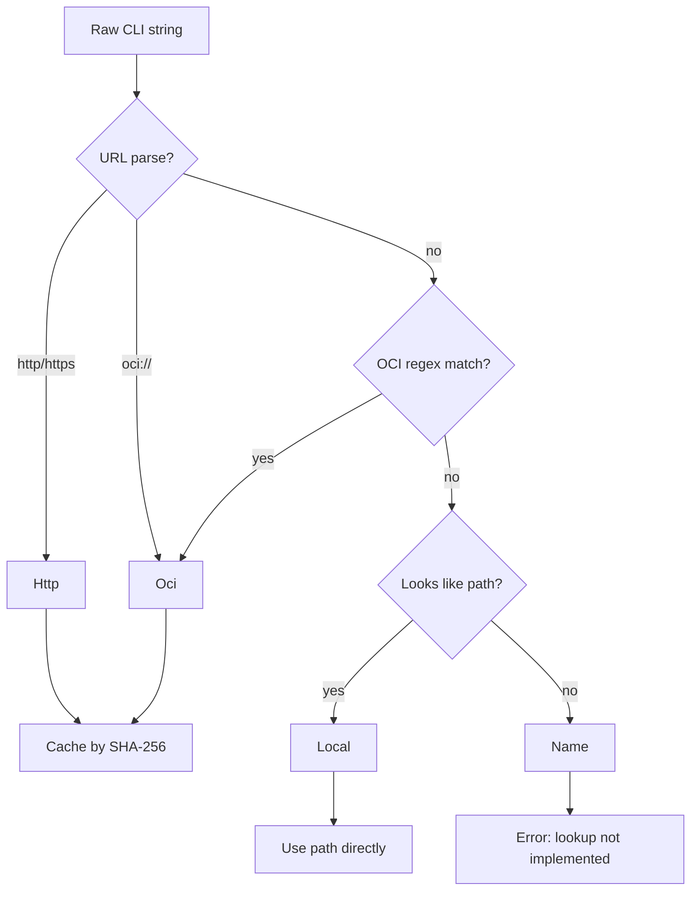

Component references are the first abstraction every `act` command relies on. The host accepts one string argument, but `resolve.rs` interprets that string as a local path, HTTP URL, OCI reference, or future logical name. This layer exists so `run`, `call`, `info`, `skill`, and `pull` can all share a single resolution path instead of each reimplementing download logic.

## What the Concept Solves

Without a reference abstraction, the CLI would need separate commands for local files, registries, and URLs. `ComponentRef` in `act-cli/src/resolve.rs` centralizes that decision. It also ensures remote downloads are normalized to a local cache entry before the runtime ever sees them, which simplifies component loading and avoids transport-specific branches in `main.rs`.

## How It Relates to Other Concepts

- It runs before [Component Host Lifecycle](/docs/component-host-lifecycle), because the runtime only knows how to load a local path.
- It interacts with [Runtime Policies](/docs/runtime-policies) indirectly, because policy decisions happen after the component bytes are available and the `act:component` manifest can be read.
- It also supports [Component Packaging](/docs/component-packaging) workflows, because `act-build validate` expects a local `.wasm` file that may have been obtained with `act pull`.

## How It Works Internally

`ComponentRef` is defined as:

```rust
pub enum ComponentRef {
    Local(PathBuf),
    Http(Url),
    Oci(String),
    Name(String),
}
```

The `FromStr` implementation in `act-cli/src/resolve.rs` uses three heuristics in order:

1. Parse as a URL. `http` and `https` become `Http`, while `oci://...` becomes `Oci`.
2. Match an OCI regex. The regex requires a dotted registry host or `localhost` plus a path.
3. Treat strings containing path separators, a `.wasm` suffix, or a leading `.` as `Local`.
4. Fall back to `Name`, which currently errors because centralized registry lookup is not implemented.

`resolve(component_ref, fresh)` then turns the enum into a local `PathBuf`. Local paths are checked with `tokio::fs::try_exists`. HTTP references stream through `reqwest::get`, while OCI references use `oci-client` to fetch the manifest and stream the first layer blob into the cache. Both remote branches use a SHA-256-derived filename under `~/.cache/act/components`.



## Basic Usage

Use an OCI component directly:

```bash
act info --tools ghcr.io/actpkg/sqlite:0.1.0
```

That call parses the value as `ComponentRef::Oci`, downloads the layer if needed, caches it, and then hands the cached file to `runtime::read_component_info`.

Use a local artifact during development:

```bash
act run --http ./target/wasm32-wasip2/release/my_component.wasm
```

That path becomes `ComponentRef::Local`, so no cache lookup or download is needed.

## Advanced and Edge-case Usage

Force a fresh download with `pull`:

```bash
act pull -O ghcr.io/actpkg/sqlite:0.1.0
```

`cmd_pull` in `act-cli/src/main.rs` always calls `resolve(&reference, true)`, which bypasses the cache and redownloads the remote artifact before copying it to the target path.

Extract a skill from an HTTP-hosted component:

```bash
act skill https://example.com/components/search.wasm --output ./.agents/skills/search
```

The `skill` command still uses the same resolver. Once the bytes are local, `cmd_skill` scans top-level custom sections until it finds `act:skill` and unpacks the tar archive to the output directory.

<Callout type="warn">A bare component name like `sqlite` currently parses successfully but still fails at resolution time because `ComponentRef::Name` is reserved for a future registry lookup path. Use a local path, HTTP URL, or OCI reference today.</Callout>

<Accordions>
<Accordion title="Why cache remote components before loading them?">

The runtime only needs a local path once resolution is complete, so normalizing remote inputs to disk keeps the Wasmtime bootstrap path simple. It also means `info`, `call`, `run`, and `skill` all benefit from the same cache key and download behavior without duplicating transport-specific setup.

The trade-off is that a remote reference is not fully ephemeral: it leaves a cache entry in `~/.cache/act/components`, which is desirable for repeatability but something operators should understand when debugging version drift.

The explicit `fresh` flag in `resolve` gives `pull` a way to bypass that cache when the user wants a deliberate re-download.

</Accordion>
<Accordion title="Why use heuristics instead of explicit transport flags?">

The source chooses convenience over strictness because the common path should be one positional argument that developers can paste from a README or a registry listing. `FromStr` makes the ergonomic path work for most inputs, including `oci://` prefixed values and plain registry references.

The downside is that borderline strings can be surprising, especially bare names that are accepted syntactically but not implemented semantically.

If you need deterministic behavior in automation, use values that are unambiguous, such as `https://...`, `ghcr.io/...`, or an explicit filesystem path.

</Accordion>
</Accordions>

For the exact public API of this layer, continue to [API Reference: resolve](/docs/api-reference/resolve).
