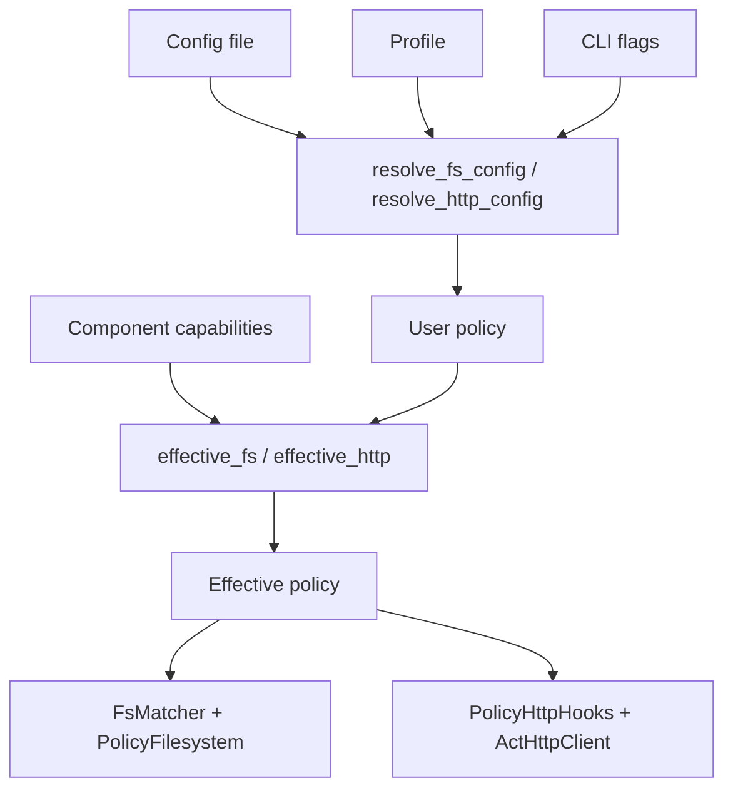

Runtime policy is the core safety mechanism in `act`. The host never instantiates a component with unrestricted ambient access unless the user asks for it and the component has declared the capability in its embedded metadata. This concept exists to make the host useful in automation and agent environments where a silent filesystem or network escape is unacceptable.

## What the Concept Is

There are two policy families:

- Filesystem policy, represented by `FsConfig` and enforced through `FsMatcher` plus a custom `wasi:filesystem` host implementation.
- HTTP policy, represented by `HttpConfig` and enforced through `PolicyHttpHooks`, `ActHttpClient`, redirect checks, and DNS filtering.

Both start with the same enum:

```rust
pub enum PolicyMode {
    Deny,
    Allowlist,
    Open,
}
```

`config.rs` resolves user intent. `runtime/effective.rs` then intersects that intent with the component's declared capabilities from the `act:component` section. The result is a ceiling model: the effective policy can only stay the same or get narrower.

## How It Relates to Other Concepts

- It depends on [Component Packaging](/docs/component-packaging), because the capability declaration comes from build-time metadata.
- It feeds directly into [Component Host Lifecycle](/docs/component-host-lifecycle), because `create_store` computes effective policy before building `HostState`.
- It constrains [Component References](/docs/component-references) only after the bytes are resolved and the manifest can be read.

## Internals Walkthrough

`resolve_opts` in `act-cli/src/main.rs` does four important things:

1. Loads `ConfigFile` with `load_config`.
2. Selects an optional profile with `get_profile`.
3. Applies CLI overrides through `resolve_fs_config` and `resolve_http_config`.
4. Merges profile metadata and CLI metadata with `resolve_metadata`.

`create_store` in `act-cli/src/runtime/mod.rs` then calls:

```rust
let effective_fs = crate::runtime::effective::effective_fs(fs, &info.std.capabilities).config;
let effective_http =
    crate::runtime::effective::effective_http(http, &info.std.capabilities).config;
```

The filesystem side uses `FsMatcher::compile` from `runtime/fs_matcher.rs` plus `PolicyFilesystemCtxView` from `runtime/fs_policy.rs`. Paths are canonicalized, checked against allow and deny globs, and then recorded per descriptor. The HTTP side uses `PolicyHttpHooks::decide_uri` from `runtime/http_policy.rs` and a reqwest DNS resolver in `runtime/http_client.rs` to enforce host, CIDR, scheme, method, and redirect decisions.



## Basic Usage

Use a named profile for repeated local development:

```toml
# ~/.config/act/config.toml
log-level = "debug"

[profile.local.policy.filesystem]
mode = "allowlist"
allow = ["/workspace/**"]

[profile.local.policy.http]
mode = "allowlist"
allow = [{ host = "api.example.com", scheme = "https" }]

[profile.local.metadata]
database_path = "/workspace/tmp/app.db"
```

```bash
act call ./component.wasm query --profile local --args '{"sql":"SELECT 1"}'
```

Open HTTP access for a single command while keeping filesystem closed:

```bash
act call \
  --http-policy open \
  --fs-policy deny \
  ./component.wasm fetch \
  --args '{"url":"https://example.com"}'
```

## Advanced and Edge-case Usage

Use a deny carve-out inside an allowlist filesystem policy:

```bash
act call \
  --fs-policy allowlist \
  --fs-allow '/workspace/**' \
  --fs-deny '/workspace/**/.env' \
  ./component.wasm inspect
```

That maps to `FsConfig { mode: Allowlist, allow, deny }`, and `FsMatcher::decide` checks deny globs before allow globs.

Use host and CIDR rules together for HTTP:

```bash
act call \
  --http-policy allowlist \
  --http-allow example.com \
  --http-deny 0.0.0.0/0 \
  --http-deny ::/0 \
  ./component.wasm fetch \
  --args '{"url":"https://example.com"}'
```

This intentionally fails. The integration test in `act-cli/tests/http_policy_e2e.rs` demonstrates that the DNS resolver removes all resolved IPs, which the client surfaces as a DNS-related failure.

<Callout type="warn">The older `--allow-dir` style flags shown in the repo skill markdown are not the current interface. The integration tests in `act-cli/tests/config_integration.rs` explicitly verify that legacy `--allow-dir` is rejected and that the supported flags are `--fs-policy`, `--fs-allow`, `--fs-deny`, `--http-policy`, `--http-allow`, and `--http-deny`.</Callout>

<Accordions>
<Accordion title="Deny-by-default vs. open-by-default">

The source defaults filesystem policy to `Deny` and HTTP policy to the default `HttpConfig`, which also resolves to deny behavior unless explicit allow rules or `open` mode are provided. That makes the secure path the accidental path, which is the right choice for agent-style automation.

The trade-off is friction during local development: components that touch the network or filesystem will fail until you add grants.

The repository chooses that friction intentionally because debugging a denied operation is cheaper than auditing a silent escape after the fact.

</Accordion>
<Accordion title="Why intersect with declared capabilities?">

`effective_fs` and `effective_http` in `runtime/effective.rs` do not trust user policy alone. If a component never declares `wasi:http`, then even `--http-policy open` collapses to `Deny` for that invocation.

This prevents host-side configuration drift from accidentally broadening a component past what its package metadata said it needed.

The cost is that poorly declared components are frustrating to use until they are rebuilt with correct metadata, but that pressure is exactly what keeps the build and runtime models aligned.

</Accordion>
</Accordions>

The next page, [Component Host Lifecycle](/docs/component-host-lifecycle), shows where those effective policies are injected into Wasmtime.
